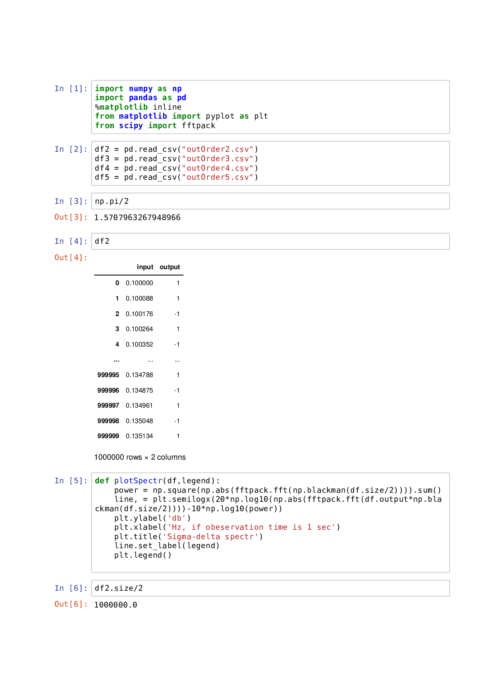
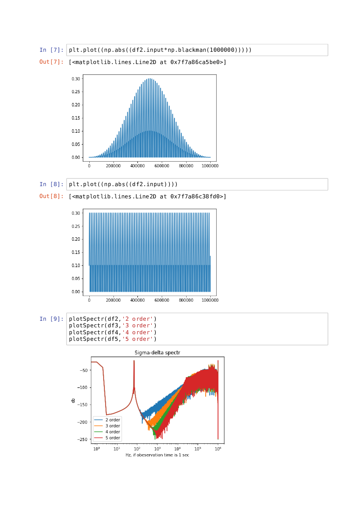

# Datasets 

The model sigma-delta modulator (SDM) is single-stage one-bit architecture or so called cascaded architecture. 

## order?.csv 

This datasets configure SDM architecture. Each rows correspond SDM stage. The stage include:
- integrator's initial value stage 
- scale coefficients <code>gi1</code> and <code>gi2</code>
- leakage coefficient <code>ai</code>

## inputs.csv

This dataset forms in Java code sinusoidal input sampling. Each row corresponds harmonic which include: 
- amplitude which is strongly depends from input scaling coefficient <code>g11</code>.
- frequency which is normed on sampling frequency. 
- phase, count for sinus. For constant or zero-harmonic just use <code>pi/2</code> value.

Resulting input is a harmonic superposition.

## outOrder?.csv

Generated by model. Controlled by inputs.cvs and order?.cvs dataset. The sampling length is specified in Java code. Include 
- <code>input</code> - input samples
- <code>output</code> - output samples

# Behavioral SDM model analysis

Model is written on Java that controlled by datasets. The model generate outOrder dataset which is analyzed in Python frameworks like Pandas, NumPy, SciPy. An environment of frameworks is deployed in Docker image. Please read documentation in your Linux distribution or Windows operation system (OS) about upping Docker service. The OS uses shell <code>run_docker_jupyter</code> script.

## Make analysis enviroment

To start navigating on project tree and Jupiter Notebook

  <code>localhost:4545/tree?</code>

can be copied to browser address line.

# Example

